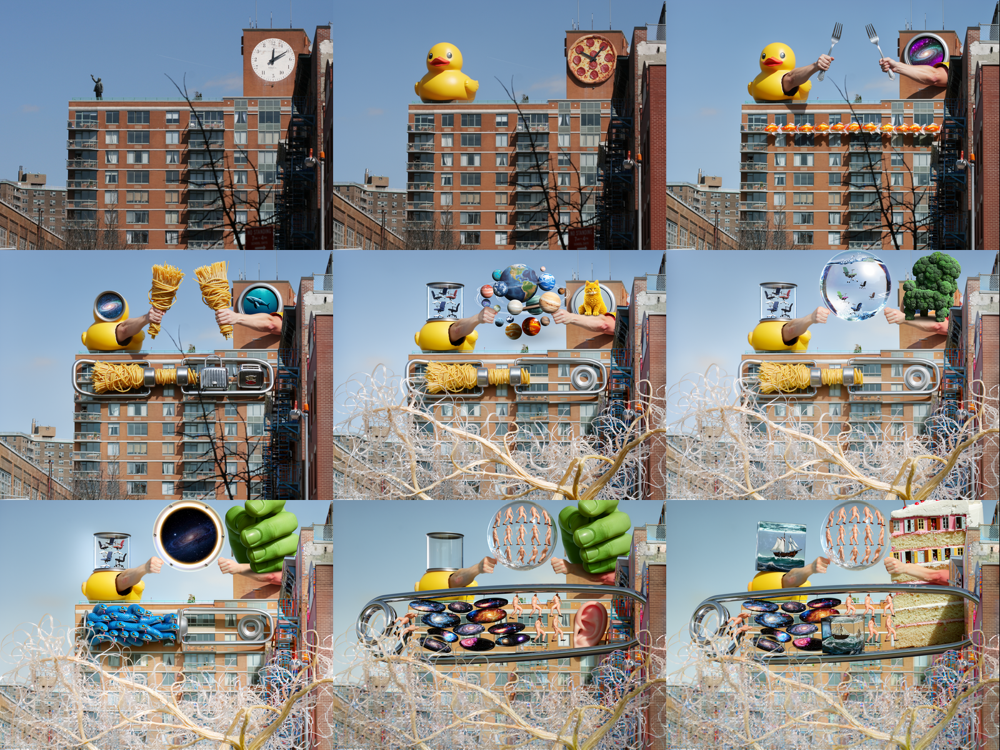
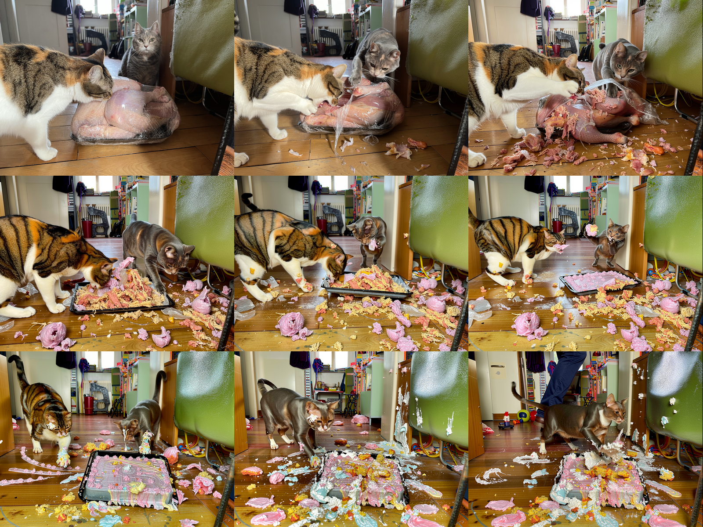
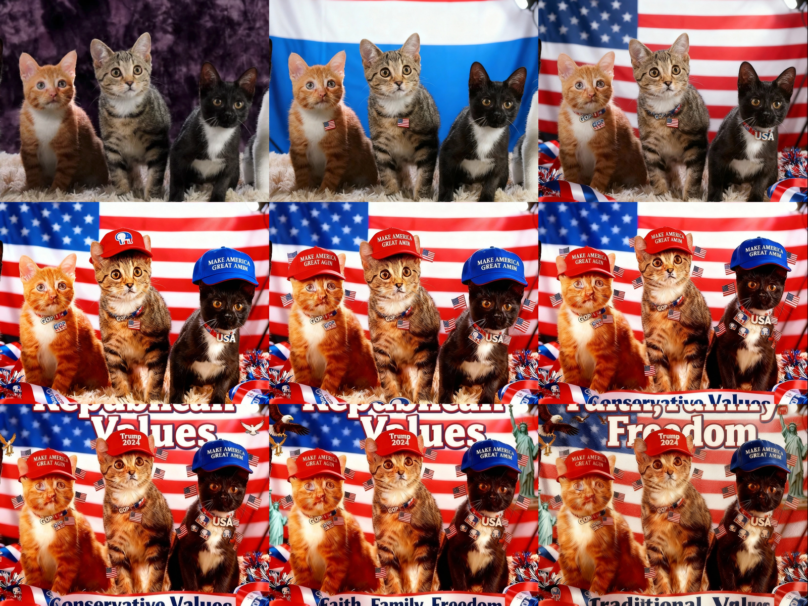
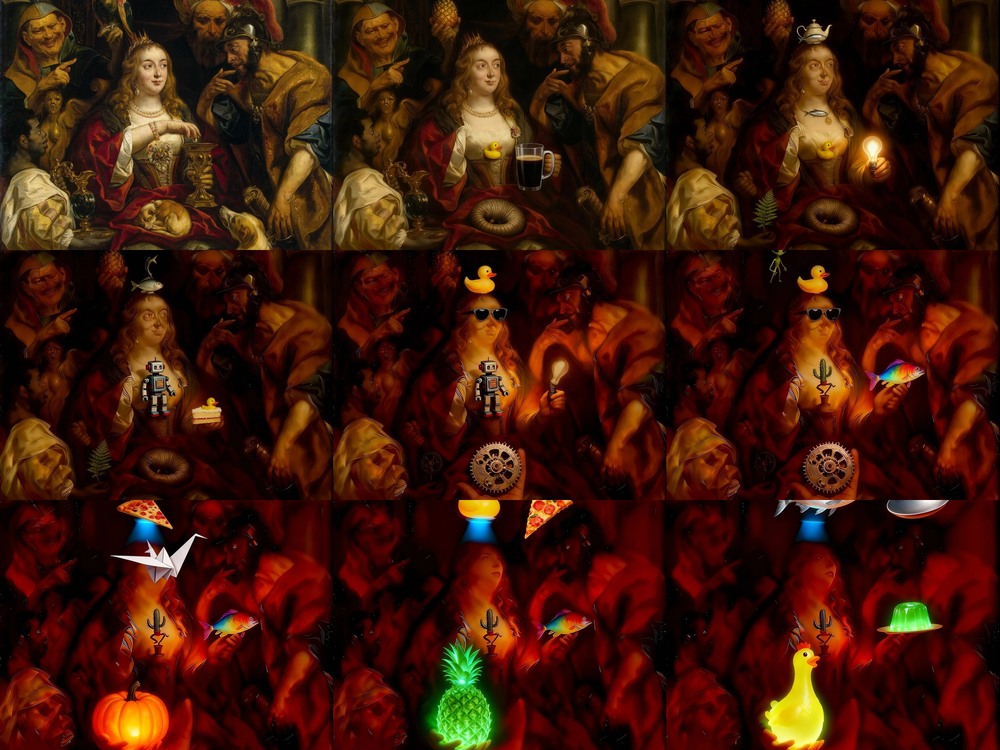

# Image Loop Generator

A CLI tool that creates animations by iteratively transforming images through AI. Feed it an image and a transformation prompt, and it runs multiple passes through an AI image model, feeding each output back as the next input. The result is a sequence of progressively transformed frames, compiled into a video.

This solution is loosely based on [nano-banana-loop](https://github.com/radames/nano-banana-loop) but uses [OpenRouter](https://openrouter.ai/) to access various image generation models (instead of fal.ai), and adds new modes and features.

## Examples

### East Village → Bizarre

Transform a street scene by progressively adding unexpected elements.

```bash
uv run src/image_loop.py --image east-village.jpg --mode bizarre --model flux-pro --frames 15
```



https://github.com/user-attachments/assets/east-village-bizarre.mp4

---

### Cats & Turkey → What Happens Next

Show a scene evolving moment by moment.

```bash
uv run src/image_loop.py --image cats-turkey.jpg --mode next --model flux-pro --frames 20 --size landscape
```



https://github.com/user-attachments/assets/cats-turkey.mp4

---

### Cats → Political Right

Push an image toward a political aesthetic (using Riverflow model).

```bash
uv run src/image_loop.py --image cats.png --mode politic-right --model riverflow --frames 10 --size square
```



https://github.com/user-attachments/assets/rightwing-cats.mp4

---

### Classical Painting → Bizarre

Transform a classical painting with increasingly surreal elements.

```bash
uv run src/image_loop.py --image painting.jpg --mode bizarre --model riverflow --frames 20 --size square
```



https://github.com/user-attachments/assets/painting-bizarre.mp4

---

## Requirements

- Python 3.11+
- [uv](https://docs.astral.sh/uv/) (recommended) or pip
- ffmpeg (for video generation)
- OpenRouter API key

## Setup

1. Clone this repository
2. Add your OpenRouter API key to `secrets.yaml`:
   ```yaml
   openrouter_api_key: sk-or-v1-your-key-here
   ```
   Or set the `OPENROUTER_API_KEY` environment variable.

## Usage

```bash
# Basic usage - transform an image with a preset mode
uv run src/image_loop.py --image photo.jpg --mode evolve --frames 10

# Use a custom prompt
uv run src/image_loop.py --image photo.jpg --mode custom --prompt "Age this person by 5 years"

# Specify model and output size
uv run src/image_loop.py --image photo.jpg --mode album-cover --model flux-pro --size square

# Continue an existing run with more frames
uv run src/image_loop.py --continue output/run_flux-pro_evolve_1218_1234_abcd --frames 10

# Generate a collage from a completed run
uv run src/collage.py output/run_flux-pro_evolve_1218_1234_abcd --grid 4x4

# List available options
uv run src/image_loop.py --list-modes
uv run src/image_loop.py --list-models
```

## Options

| Option | Description |
|--------|-------------|
| `--image`, `-i` | Input image path (required for new runs) |
| `--mode`, `-m` | Transformation mode (see below) or `custom` |
| `--prompt`, `-p` | Custom prompt (required when mode is `custom`) |
| `--frames`, `-n` | Number of frames to generate (default: 10) |
| `--model` | Model to use (default: flux-pro) |
| `--size`, `-s` | Output size: square, landscape, portrait, wide, tall (default: landscape) |
| `--output`, `-o` | Output directory (default: output) |
| `--temperature`, `-t` | Generation temperature (default: 0.7) |
| `--top-p` | Top-p sampling (default: 0.9) |
| `--fps` | Video frame rate (default: 1) |
| `--continue`, `-c` | Continue from an existing run directory |
| `--verbose`, `-v` | Show detailed API responses |

## Available Modes

**Camera movements:** `up`, `down`, `left`, `right`, `rotate-left`, `rotate-right`, `zoom-in`, `zoom-out`

**Time:** `future`, `past`, `next`

**Style:** `dramatic`, `peaceful`, `powerful`, `vintage`, `futuristic`, `minimalist`, `wes-anderson`, `album-cover`

**Modifications:** `funny`, `bizarre`, `highlight`, `corrections`, `realistic`, `graffiti`, `improve`

**Scene:** `nature`, `urban`, `crowded`, `empty`

**Other:** `evolve`, `cooler`, `sexy`, `makeup`, `politic-left`, `politic-right`, `opposite`

Use `--mode custom --prompt "your prompt"` for custom transformations.

## Available Models

| Shortcut | Full Model ID |
|----------|---------------|
| `flux-pro` | black-forest-labs/flux.2-pro |
| `gemini-flash-image` | google/gemini-2.5-flash-image |
| `riverflow` | sourceful/riverflow-v2-standard-preview |

You can also use any full OpenRouter model ID directly.

## Output Structure

Each run creates a timestamped directory:
```
output/run_flux-pro_evolve_1218_1234_abcd/
├── images/
│   ├── frame_000.png  (initial image)
│   ├── frame_001.png
│   ├── frame_002.png
│   └── ...
├── animation.mp4
└── report.txt
```

The report includes generation time, token usage, and costs.

## Output Sizes

| Size | Dimensions | Aspect Ratio |
|------|------------|--------------|
| landscape (default) | 1024×768 | 4:3 |
| square | 1024×1024 | 1:1 |
| portrait | 768×1024 | 3:4 |
| wide | 1280×720 | 16:9 |
| tall | 720×1280 | 9:16 |

## Collage Tool

Generate a grid collage from a completed run:

```bash
# 3x3 collage (default medium size: 1600x1200)
uv run src/collage.py output/run_flux-pro_evolve_1218_1234_abcd --grid 3x3

# 4x4 large collage
uv run src/collage.py output/run_flux-pro_evolve_1218_1234_abcd --grid 4x4 --size large

# Custom output path
uv run src/collage.py output/run_flux-pro_evolve_1218_1234_abcd --grid 3x3 -o my_collage.png
```

| Option | Description |
|--------|-------------|
| `--grid`, `-g` | Grid size (e.g., 3x3, 4x4, 5x3) |
| `--size`, `-s` | Output size: small (800x600), medium (1600x1200), large (2400x1800) |
| `--output`, `-o` | Output file path (default: collage_NxM.png in run folder) |

The collage evenly distributes frames across the grid, always including the first and last frame.

## Project Structure

```
src/
├── image_loop.py    # Main CLI tool
└── collage.py       # Collage generator
examples/            # Example outputs
secrets.yaml         # API keys (git-ignored)
output/              # Generated runs (git-ignored)
```

## Contributing

PRs welcome. The codebase uses inline dependencies managed by uv.

