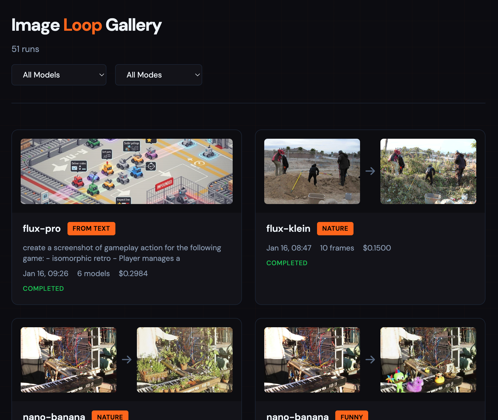
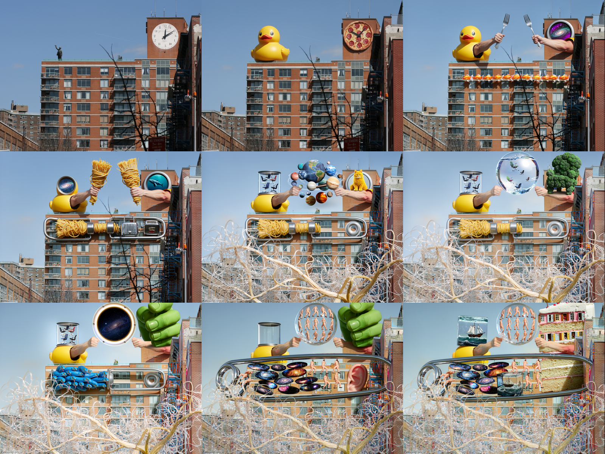
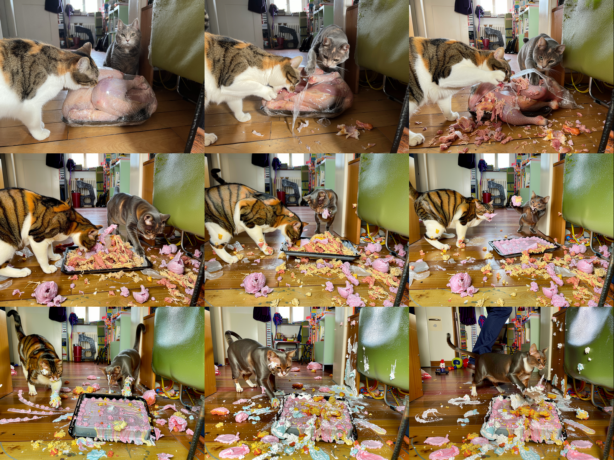
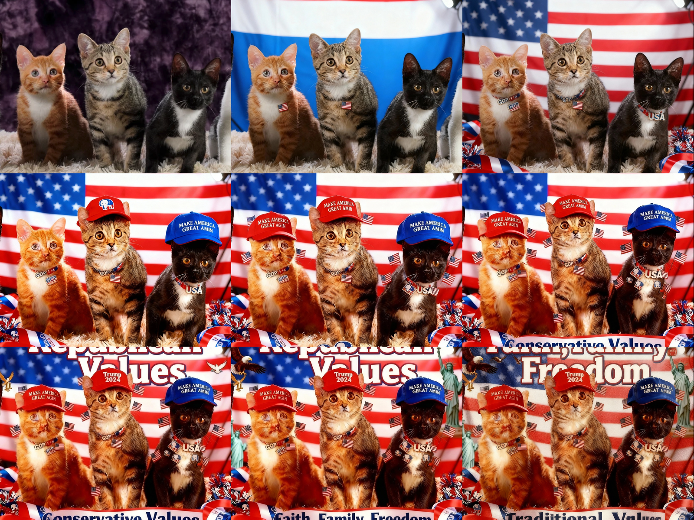
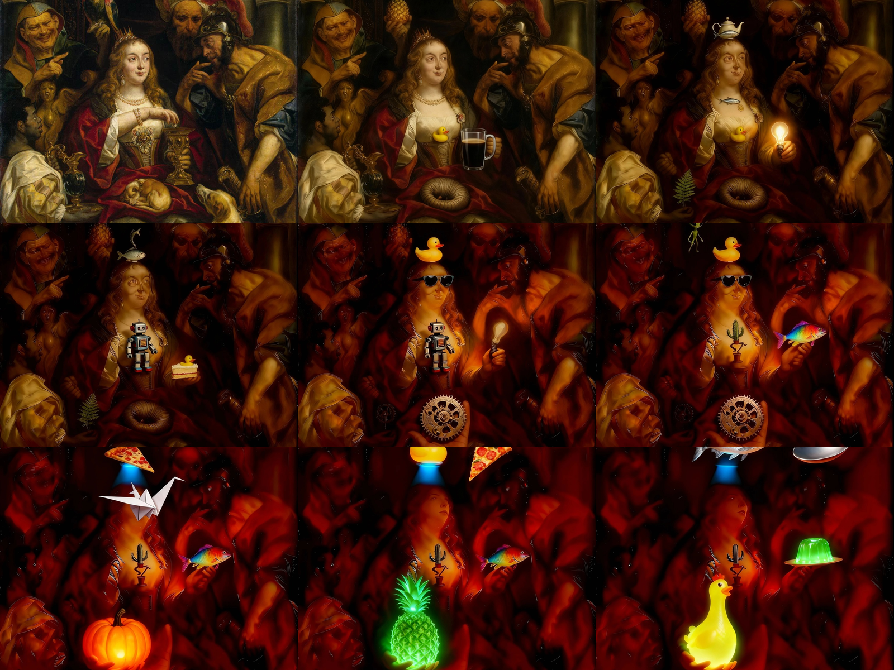

# Image Loop Generator

A CLI tool that creates animations by iteratively transforming images using AI models via OpenRouter. Give it an image and a "mode" (a preset prompt), and it runs multiple passes through an AI image model, passing each output back as the next input. The result is a sequence of progressively transformed frames, compiled into a video or GIF.

I developed this as a way to research different image models to identify biases and limitations. As images are progressively transformed you can also observe artifacts and distortions that emerge.

This project is loosely based on [nano-banana-loop](https://github.com/radames/nano-banana-loop) but uses [OpenRouter](https://openrouter.ai/) to access various [image generation models](https://openrouter.ai/models?fmt=cards&input_modalities=image&output_modalities=image&order=newest) (instead of fal.ai), and adds new modes and features.

## Flow

1. **Input**: provide an image and a preset mode (or custom prompt)
2. **Iteration**: the image is passed to the model with the transformation prompt
3. **Feedback Loop**: Each generated frame becomes the input for the next frame
4. **Output**: The sequence of frames is compiled into a video or GIF
5. **Review**: The gallery displays all runs in a simple web interface

Each run creates a timestamped directory with all frames, metadata, and generated animations.

## Quick Start

### Requirements

- Python 3.11+
- [uv](https://docs.astral.sh/uv/) (recommended) or pip with virtual environment
- ffmpeg (for video generation)
- OpenRouter API key

### Setup

1. Clone this repository
2. Install dependencies (choose one method below)
3. Add your OpenRouter API key to `secrets.yaml`:
   ```yaml
   openrouter_api_key: sk-or-v1-your-key-here
   ```
   Or set the `OPENROUTER_API_KEY` environment variable.

#### Installation Methods

**Option 1: Using uv (Recommended)**

`uv` automatically manages dependencies and Python versions:

```bash
# Install uv (if not already installed)
curl -LsSf https://astral.sh/uv/install.sh | sh

# No additional setup needed - dependencies are managed automatically
```

**Option 2: Using pip with virtual environment**

```bash
# Create a virtual environment
python3 -m venv venv

# Activate it
# On macOS/Linux:
source venv/bin/activate
# On Windows:
# venv\Scripts\activate

# Install dependencies
pip install -r requirements.txt
```


**Note:** The gallery (`src/gallery.py`) can run standalone but still requires dependencies for parsing run metadata. All scripts share the same dependency set.

### Basic Usage

Note: With `uv`, add `uv run` to run the commands below.

```bash
# Transform an image with a preset mode
python src/image_loop.py --image photo.jpg --mode evolve --frames 10

# Use a custom prompt
python src/image_loop.py --image photo.jpg --mode custom --prompt "Age this person by 5 years"

# Specify model and output size
python src/image_loop.py --image photo.jpg --mode album-cover --model flux-pro --size square

# Continue an existing run with more frames
python src/image_loop.py --continue output/run_flux-pro_evolve_1218_1234_abcd --frames 10

# List available options
python src/image_loop.py --list-modes
python src/image_loop.py --list-models
```

**Note:** Make sure your virtual environment is activated when using standard Python. With `uv`, dependencies are managed automatically.


## Gallery

View all your generated runs in a web gallery:



```bash
# With uv:
uv run src/gallery.py

# With standard Python:
python src/gallery.py

# Custom port and output directory
uv run src/gallery.py --port 3000 --output-dir /path/to/output
# or
python src/gallery.py --port 3000 --output-dir /path/to/output
```

The gallery displays:
- **Run cards** with thumbnails of first and last frames
- **Filtering** by model and mode
- **Modal viewer** with frame-by-frame navigation
- **Statistics** including cost, time, and frame details
- **Playback controls** for animating through frames

Open `http://localhost:8080` in your browser to view the gallery.

## Examples

### East Village → Bizarre

Transform a street scene by progressively adding unexpected elements.

```bash
# With uv:
uv run src/image_loop.py --image east-village.jpg --mode bizarre --model flux-pro --frames 15

# With standard Python:
python src/image_loop.py --image east-village.jpg --mode bizarre --model flux-pro --frames 15
```



https://github.com/somebox/ai-feedback-loops/raw/refs/heads/main/examples/east-village-bizarre.mp4

---

### Cats & Turkey → What Happens Next

Show a scene evolving moment by moment.

```bash
uv run src/image_loop.py --image cats-turkey.jpg --mode next --model flux-pro --frames 20 --size landscape
# or: python src/image_loop.py --image cats-turkey.jpg --mode next --model flux-pro --frames 20 --size landscape
```



https://github.com/somebox/ai-feedback-loops/raw/refs/heads/main/examples/cats-turkey.mp4

---

### Cats → Political Right

Push an image toward a political aesthetic (using Riverflow model).

```bash
uv run src/image_loop.py --image cats.png --mode politic-right --model riverflow --frames 10 --size square
# or: python src/image_loop.py --image cats.png --mode politic-right --model riverflow --frames 10 --size square
```



https://github.com/somebox/ai-feedback-loops/raw/refs/heads/main/examples/rightwing-cats.mp4

---

### Classical Painting → Bizarre

Transform a classical painting with increasingly surreal elements.

```bash
uv run src/image_loop.py --image painting.jpg --mode bizarre --model riverflow --frames 20 --size square
# or: python src/image_loop.py --image painting.jpg --mode bizarre --model riverflow --frames 20 --size square
```



https://github.com/somebox/ai-feedback-loops/raw/refs/heads/main/examples/painting-bizarre.mp4

---
## Command-Line Options

### Core Options

| Option | Description |
|--------|-------------|
| `--image`, `-i` | Input image path (required for new runs) |
| `--mode`, `-m` | Transformation mode (see [Available Modes](#available-modes)) or `custom` |
| `--prompt`, `-p` | Custom prompt (required when mode is `custom`) |
| `--frames`, `-n` | Number of frames to generate (default: 10) |
| `--model` | Model to use (default: flux-pro, see [Available Models](#available-models)) |
| `--size`, `-s` | Output size: auto, preserve, custom, or preset (default: auto, see [Output Sizes](#output-sizes)) |
| `--continue`, `-c` | Continue from an existing run directory |
| `--output`, `-o` | Output directory (default: output) |

### Advanced Options

| Option | Description |
|--------|-------------|
| `--temperature`, `-t` | Generation temperature 0.0-2.0 (default: 0.7, Gemini models only) |
| `--top-p` | Top-p sampling 0.0-1.0 (default: 0.9, Gemini models only) |
| `--seed` | Random seed for reproducibility (Flux and Gemini models) |
| `--fps` | Video/GIF frame rate (default: 1) |
| `--format`, `-f` | Output format: mp4, gif, or both (default: mp4) |
| `--verbose`, `-v` | Show detailed API responses |
| `--list-modes` | List all available transformation modes |
| `--list-models` | List available image generation models from OpenRouter |

**Note:** Parameter support varies by model. Use `--list-models` to see which parameters each model supports.

## Available Modes

**Camera movements:** `up`, `down`, `left`, `right`, `rotate-left`, `rotate-right`, `zoom-in`, `zoom-out`

**Time:** `future`, `past`, `next`

**Style:** `dramatic`, `peaceful`, `powerful`, `vintage`, `futuristic`, `minimalist`, `wes-anderson`, `album-cover`

**Modifications:** `funny`, `bizarre`, `highlight`, `corrections`, `realistic`, `graffiti`, `improve`

**Scene:** `nature`, `urban`, `crowded`, `empty`

**Other:** `evolve`, `cooler`, `sexy`, `makeup`, `politic-left`, `politic-right`, `opposite`

Use `--mode custom --prompt "your prompt"` for custom transformations.

## Available Models

Run `--list-models` to fetch available image generation models from OpenRouter with current pricing:

```bash
# With uv:
uv run src/image_loop.py --list-models

# With standard Python:
python src/image_loop.py --list-models
```

**Configured shortcuts:**

| Shortcut | Full Model ID |
|----------|---------------|
| `flux-pro` | black-forest-labs/flux.2-pro |
| `seedream` | bytedance-seed/seedream-4.5 |
| `nano-banana` | google/gemini-2.5-flash-image |
| `nano-banana-pro` | google/gemini-3-pro-image-preview |
| `riverflow` | sourceful/riverflow-v2-standard-preview |

You can use any full OpenRouter model ID directly with `--model`.

## Output Sizes

| Size | Dimensions | Description |
|------|------------|-------------|
| auto (default) | varies | Picks the closest preset to input aspect ratio |
| preserve | varies | Scales to fit max 1280px, preserves exact aspect ratio |
| custom | --width --height | Explicit dimensions (requires both flags) |
| landscape | 1024×768 | 4:3 aspect ratio |
| square | 1024×1024 | 1:1 aspect ratio |
| portrait | 768×1024 | 3:4 aspect ratio |
| wide | 1280×720 | 16:9 aspect ratio |
| tall | 720×1280 | 9:16 aspect ratio |

The tool warns when significant cropping will occur due to aspect ratio mismatch.

## Output Structure

Each run creates a timestamped directory:
```
output/run_flux-pro_evolve_1218_1234_abcd/
├── images/
│   ├── frame_000.png  (initial image)
│   ├── frame_001.png
│   ├── frame_002.png
│   └── ...
├── animation.mp4      (when --format mp4 or both)
├── animation.gif      (when --format gif or both)
└── run.json
```

The `run.json` file contains comprehensive logging:
- **Summary**: Quick overview with status, total cost, and time
- **Config**: All generation parameters (model, prompt, size, etc.)
- **Stats**: Cumulative statistics across all sessions
- **Sessions**: History of generation runs including continuations
- **Frames**: Per-frame details with timing, file sizes, token usage, and API responses

Example `run.json` structure:
```json
{
  "summary": {
    "created": "2026-01-15T09:12:14",
    "model": "google/gemini-2.5-flash-image",
    "mode": "future",
    "total_frames": 10,
    "total_cost": "$0.39",
    "total_time": "147.3s",
    "status": "completed"
  },
  "config": { ... },
  "stats": { ... },
  "sessions": [ ... ],
  "frames": [ ... ]
}
```

## Additional Tools

### Text-to-Image Generation

Generate a single image from text (without the loop):

```bash
# With uv:
uv run src/generate_from_text.py "A futuristic cityscape at sunset" --model flux-pro --output city.png

# With standard Python:
python src/generate_from_text.py "A futuristic cityscape at sunset" --model flux-pro --output city.png
```

Outputs from text-to-image generation will also be displayed in the gallery.


### Collage Generator

Generate a grid collage from a completed run:

```bash
# 3x3 collage (default medium size: 1600x1200)
# With uv:
uv run src/collage.py output/run_flux-pro_evolve_1218_1234_abcd --grid 3x3
# With standard Python:
python src/collage.py output/run_flux-pro_evolve_1218_1234_abcd --grid 3x3

# 4x4 large collage
uv run src/collage.py output/run_flux-pro_evolve_1218_1234_abcd --grid 4x4 --size large

# Custom output path
uv run src/collage.py output/run_flux-pro_evolve_1218_1234_abcd --grid 3x3 -o my_collage.png
```

| Option | Description |
|--------|-------------|
| `--grid`, `-g` | Grid size (e.g., 3x3, 4x4, 5x3) |
| `--size`, `-s` | Output size: small (800x600), medium (1600x1200), large (2400x1800) |
| `--output`, `-o` | Output file path (default: collage_NxM.png in run folder) |

The collage evenly distributes frames across the grid, always including the first and last frame.


## Configuration

Settings are managed in `settings.yaml`:

- **Models**: Model shortcuts and full IDs
- **Prompts**: Transformation mode prompts
- **Defaults**: Default model, frame count, etc.
- **Sizes**: Size preset definitions
- **API**: Timeout and other API settings

You can modify `settings.yaml` to add new modes, change defaults, or configure additional models.

## Development

### Project Structure

```
src/
├── image_loop.py          # Main CLI entry point
├── gallery.py             # Web gallery server
├── generate_from_text.py  # Text-to-image tool
├── collage.py             # Collage generator
└── imageloop/             # Core package
    ├── api.py             # OpenRouter API client
    ├── cli.py             # CLI argument parsing and commands
    ├── job.py             # Frame management and output generation
    ├── runlog.py          # Run logging and persistence
    ├── settings.py        # Settings loading and resolution
    ├── sizing.py          # Image sizing and aspect ratio handling
    └── storage.py         # Image I/O and API key management
tests/                      # Pytest test suite
settings.yaml              # Configuration file
secrets.yaml               # API keys (git-ignored)
output/                    # Generated runs (git-ignored)
```

### Running Tests

```bash
# Run all tests
pytest

# Run with verbose output
pytest -v

# Run only tests that don't require API calls
pytest -m "not live_api"
```

### Code Organization

The codebase is modularized into focused modules:

- **`imageloop.api`**: Handles all OpenRouter API interactions
- **`imageloop.cli`**: Command-line interface and orchestration
- **`imageloop.job`**: Frame finding and video/GIF generation
- **`imageloop.runlog`**: Run state persistence and reporting
- **`imageloop.settings`**: Configuration loading and resolution
- **`imageloop.sizing`**: Image dimension calculations and resizing
- **`imageloop.storage`**: Image file I/O and data URI conversion

### Contributing

PRs welcome. The codebase uses inline dependencies (PEP 723) which work with `uv`, but a `requirements.txt` is also provided for standard pip workflows.

When contributing:
- Follow the existing modular structure
- Add tests for new functionality
- Update `settings.yaml` if adding new modes or models
- Keep the README up to date with any new features
