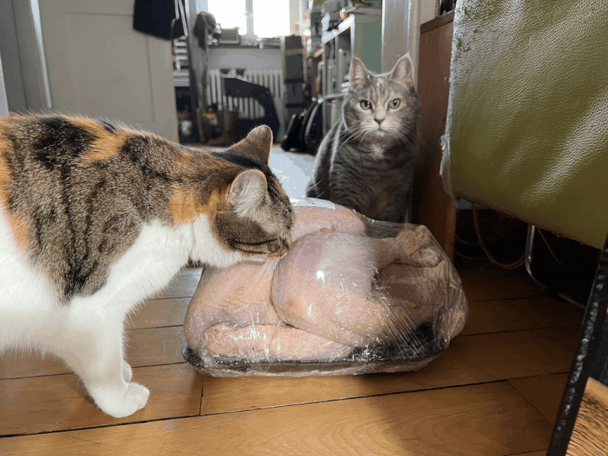
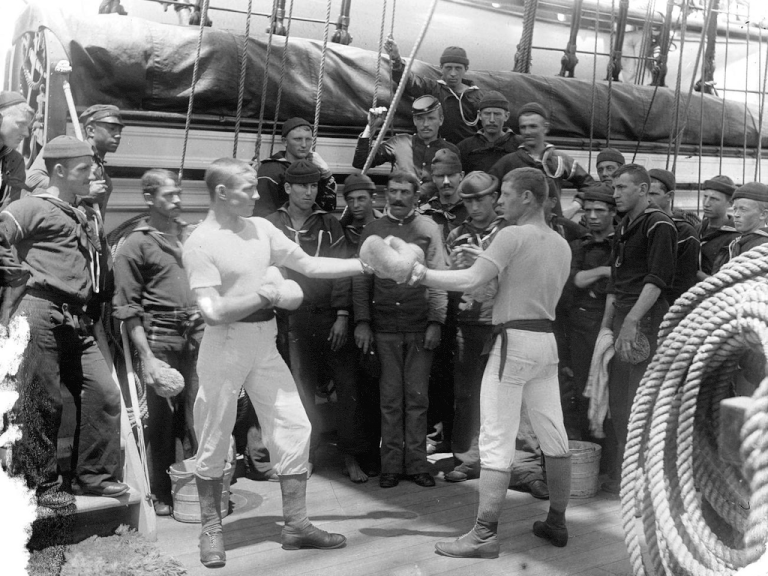

# Examples

Generated examples of image loop animations.

## Example 1: Next with riverflow

**Command:**
```bash
python src/image_loop.py --image tmp/cats-turkey.png --mode next --model riverflow --format both
```

**Model:** riverflow (sourceful/riverflow-v2-standard-preview)
**Cost:** $0.3500
**Frames:** 11



---

## Example 2: Peaceful with nano-banana

**Command:**
```bash
python src/image_loop.py --image tmp/lc_dig_det_4a14352_105.jpg --mode peaceful --model nano-banana --format both
```

**Model:** nano-banana (google/gemini-2.5-flash-image)
**Cost:** $0.3901
**Frames:** 11



---

## Example 3: Next with riverflow

**Command:**
```bash
python src/image_loop.py --image tmp/Wikipedians_dancing_at_Mouseo_Soumaya.jpg --mode next --model riverflow --format both
```

**Model:** riverflow (sourceful/riverflow-v2-standard-preview)
**Cost:** $0.7000
**Frames:** 21


---
